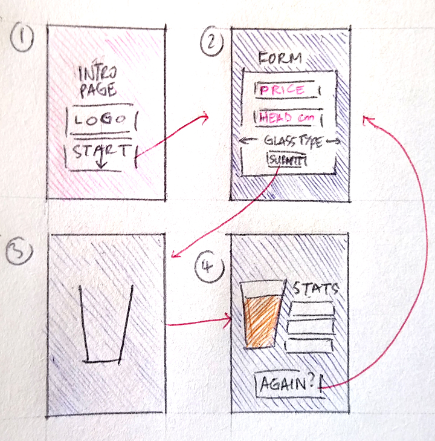
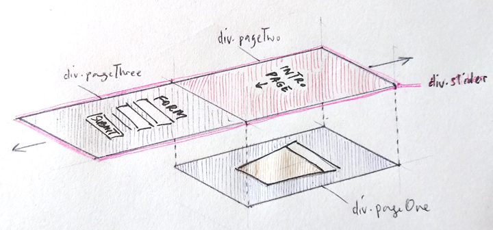

Pint Pedant is a web app that calculates how much froth is in your beer by modelling your beer glass as a truncated cone. Here's some background on the project, followed by a more detailed development walkthrough with coding examples.

Why are pint glasses usually wider at the top? It could just be to make them easier to grip, but that's a bit boring, so here's another theory: what if wide brims are actually a devious ploy by beer companies to con you out of beer?

Human beings are quite bad at judging volume. If you don't believe me, have a look at the two objects below: the one on the left is a rough representation of a "yard" glass, a traditional British ale glass used for drinking games. It's about a yard tall, hence the name, with a flared rim and a bulb at the bottom, which means you'll probably get splashed with beer if you try to drink from one (all part of the fun).

On the right you'll see a shallow dish-like object. This model is based on the measurements for the official 175g DisCraft ultimate frisbee disc, used in the popular college sport of ultimate frisbee (and it's many associated drinking games). So which vessel should you pick for a truly impressive feat of drinking?

You may have guessed the point I'm about to make, but weirdly enough, the frisbee is the winner here. I checked this by modelling both objects and using some formulae (volume of a sphere, volume of a truncated cone) to calculate the results.

    function sphereVol (radius) {
      return 4/3*Math.PI *
        Math.pow(radius, 3);
    }

    function truncatedConeVol(height, rad1, rad2) {
      return (
        (1 / 3) *
        Math.PI *
        height *
        (Math.pow(rad1, 2) + Math.pow(rad2, 2) + rad1 * rad2)
      );
    }

    const frisbeeVol = Math.round(truncatedConeVol(2.6,14.4,14.1));

    const yardVol = Math.round(truncatedConeVol(83.4,3,1)+sphereVol(4));

    console.log(frisbeeVol)
    console.log(yardVol)

    //expected result: 1659
    //expected result: 1403

We can treat the frisbee as a very shallow truncated cone. Using the measurements from the diagram, its volume comes out as 1659ml.

We can treat the yard glass as a very elongated truncated cone with a sphere stuck to the bottom of it (for simplicity's sake I've ignored the small overlap between the cone and the sphere which would exist in a real glass). Crunch the numbers from the diagram and we get a volume of 1403ml; that's a difference of more than half a pint!

If you're puzzled by this, don't worry, it's normal. Challenges involving judging volumes were first used in the early 20th Century by psychologist Jean Piaget as part of a test to measure mental development in children (I can actually remember doing one of these questions as part of my SAT exams in primary school). Piaget's tests work on the basis that "conservation", the ability to determine that a quantity will stay the same even if the size or shape of the container is changed, is not instinctive, but a acquired ability which requires well-developed critical thinking skills. In other words, you have to learn how to do it...and drinking beer probably makes you worse at it.

We've seen that it's very easy to be tricked when comparing the volume of a wide but shallow object against a tall but narrow one. In a typical pint glass the wide part is at the top, which is where the frothy head on top of your beer goes, so what if beer companies are making their brims wider on purpose, knowing you'll probably underestimate how much froth they're giving you?

I can't prove that, but I do know that the British Beer and Pub Association (the leading industry organisation for British pubs and bars) recommends that ["a measure of beer served with a head must include a minimum of 95% liquid"](https://beerandpub.com/briefings/head-on-beer-guidance/) with the remaining 5% as froth. Reckon you can guess what 5% looks like at the top of a pint glass? Nor do I, which is why I've built this tool to let you estimate how much beer is in your glass without relying purely on intuition!

_The problem_

Make a web app which gives visual output and statistical information about your pint of beer based on information about the cost, the type of glass, and the amount of head.

Inputs:

- Cost  
- Head   
- Depth  
- Glass type (e.g. standard pint glass, pilsner glass, stubby pint glass...)

Outputs:

- Froth volume  
- Beer volume  
- Percentage froth  
- Froth cost

The user inputs the head depth they have observed on their beer, selects a glass type from a predetermined list, and inputs the price.

The program calculates the froth volume based on the head depth and the specific glass type and returns this along with a selection of statistics derived from the initial froth volume calculation.

_Assumptions/limitations:_

To find the volumes of the yard glass and the ultimate frisbee I modelled them using regular 3D shapes whose properties are well understood. In real life, beer glasses come in many shapes and sizes; and there's no simple way to model them all. However, many of them are essentially "conical" in style, resembling a tapered cylinder, and its these glasses I'm focusing on. They can be defined mathematically using a few key measurements (height, top radius, bottom radius), and I already have a way of calculating volume using the `truncatedConeVol` function. Using this system, a "pilsner" style glass is a long, thin truncated cone, while a "stubby" pint glass is short, with a wide top radius. We can even use this approach to model half pint glasses as long as we keep a record of volume as well.

In real life many beer glasses are curved, and although there are well-understood ways to describe curved objects and calculate their volume (e.g. by modelling them as solids of revolution and using calculus) I decided not to step into this, in order keep this as a coding and web development challenge rather than a maths challenge!

Another problem with real life pint glasses is that they rarely ever have a volume of exactly one pint (568ml). A quick search online shows that many are sold as having a volume of 560 or 570ml, and I'm sure real world testing would reveal a whole range of other values besides these. This is a complete mess, so to keep things simple I'm just going to assume that a pint is a pint and model all my glasses as having a volume of exactly 568ml, or 284ml for a half-pint.

_Modelling the glasses_

Now that I've decided what my glasses will be like, I should be able to create a set of glasses as Javascript objects with keys for height, volume and radius, and then create a function which calculates froth volume for any glass type by accessing the object keys.

What should the object look like?

I measured a pint glass I have at home and determined its height, top radius, and base radius as 14cm, 4cm and 3.2cm respectively.

~~~~~~~~~~~~~~~~
 __rad1___
|         |
___________ _
\         /  |      rad1 = 14
 \       /   |h     rad2 = 3.2
  \     /    |      h = 14
   \___/    _|           

   |___|
   rad2
~~~~~~~~~~~~~~~~~

In theory, its volume should be 568ml, but as I've said before, this is rarely accurate. Crunching the numbers using the `truncatedConeVol` function from earlier confirms this:

    console.log(truncatedConeVol(14,4,3.2));

    //output: 572.35629...

I'm out by a few ml; either my pint glass has an inaccurate volume, or my measurements aren't completely right. In either case, it's messy. For simplicity and accuracy I really want to model my glass using a full set of nice round values, but this just isn't possible. At least one of my four values (`height`, `rad1`, `rad2`, `volume`) will have to be a fiddly decimal number in order for the other three to be neat integers. I've already decided using my "pint is a pint" rule that my glass needs to be exactly 568ml, so with this locked in I've decided to model the glass using nice round values for height and rad1, since these are the easiest to measure. That leaves `rad2` as the messy, derived value. I can now write my glass as a Javascript object as follows:

    const standardPintGlass = {
      height: 14,
      rad1: 4,
      volume: 568,
    };

I still need `rad2` for my calculations, so I now need a function to find rad2. This is a bit messy because it involves rearranging the [formula for a truncated cone](https://www.calculatorsoup.com/calculators/geometry-solids/conicalfrustum.php) and using the [quadratic formula](https://en.wikipedia.org/wiki/Quadratic_formula) to find a solution. The functions I've written below will do the job; they are not very succinct, but I wanted to write a separate function for the classic quadratic formula just to make it a bit clearer what process we are using to derive `rad2`.

    function quadFormula(a, b, c) {
      return (-b + Math.sqrt(b * b - 4 * a * c))/(2*a);
    }

    function findRad2(glass){

      let newVar = Math.pow(glass.rad1, 2) - glass.volume / ((Math.PI*glass.height) / 3);

      return quadFormula(1, glass.rad1, newVar);
    }

    console.log(findRad2(standardPintGlass));

    // expected output: 3.17134....

I can see from this that my real life measurement of 3.2cm was actually pretty close!

Now that I have a system I like I can go ahead and create objects for a whole range of glass styles:

    const standardPintGlass = {
      height: 14,
      rad1: 4,
      volume: 568
    };

    const standardHalfPintGlass = {
      height: 11,
      rad1: 3.5,
      volume: 284
    };

    const stubbyPintGlass = {
      height: 10,
      rad1: 4.5,
      volume: 568
    };

    const pilsnerPintGlass = {
      height: 20,
      rad1: 3.5,
      volume: 568
    };

_Calculating froth_

Now that I've created my glasses, I need to think about calculating froth. Modelling my glass as a truncated cone makes this easy, because I can take my glass of beer and chop through it horizontally to segment it into two smaller cones, one for the froth and one for the beer. I can then crunch my numbers through `truncatedConeVol` to figure out my froth volume.

Here's an illustration:

~~~~~~~~~~~~~~~~~~~

     glass:           froth:                       beer:

     _rad1
    |     |                                        radNew
   _ ____________                                  |    |
  |  \          /     _rad1_                        __________ _
h |   \        /     |      |                       \        /  |
  |    \      /    =  ____________ _            +    \      /   |h - heightNew
  |_    \____/        \__________/ _| heightNew       \____/   _|

        |_|           |____|                          |_|
        rad2          radNew                          rad2

glass.volume = truncatedConeVol(h, rad1, rad2)
froth.volume = truncatedConeVol (heightNew, rad1, radNew)
beer.volume = glass.volume-froth.volume

~~~~~~~~~~~~~~~~~~~

This is neat, but in order to calculate the froth volume I need to find `heightNew` and `radNew`. `heightNew` is easy because it will be supplied by the user. `radNew` is trickier because it needs to be calculated. In order to find the bottom radius of the cone at any given height we can use the fact that the steepness of the cone is constant, meaning change in radius is directly proportional to change in height. In the illustration below it's clear that when we halve the height, the difference between the top and bottom radii is also halved.

~~~~~~~~~~~~~~~~~~~

  _rad1_
 |      |            

 difference =       
 (rad1-rad2)         radNew
   _|__              |    |
 _|____|________     (rad1-rad2)/2
|  \   |       /      _|
h   \  |      /      |__|______ _
|    \ |     /        \ |     /  h/2
|_    \|____/          \|____/  _|

      |_|              |_|
      rad2             rad2  

rad2 + difference = rad1
rad2 + difference/2 = radNew

~~~~~~~~~~~~~~~~~~~

If we slice the glass exactly half way up, we know that `radNew` will be exactly halfway between `rad2` and `rad1`. Likewise, if we slice the glas 28% of the way up `radNew` will be exactly 28% of the way between `rad2` and `rad1`. The same rule applies for any height.

We can express this as follows:

    let headRatio = heightNew / glass.height;
    let radNew = glass.rad1 - headRatio * (glass.rad1 - rad2);

Once we've calculated the froth volume and the glass volume we can derive the beer volume. A user supplied price input means we can now generate all the outputs we need:

- Froth volume = `truncatedConeVol(newHeight, radNew, rad2)`
- Beer volume  = `glass volume - froth volume`
- Froth percentage = `froth volume / glass volume * 100`
- Froth price = `froth volume / glass volume * price`

I can now write a function which takes glass type, head height and pint price as inputs, and gives me back all the outputs I need.

    function checkHead(glass, inputHeadHeight, inputPrice) {
      let result = [];

      let rad2 = findRad2(glass);

      let headRatio = inputHeadHeight / glass.height;
      let radNew = glass.rad1 - headRatio * (glass.rad1 - rad2);

      let headVol = findVol(inputHeadHeight, glass.rad1, radNew);
      let volProportion = headVol / glass.volume;
      let headPrice = volProportion * inputPrice;

      result.push(Math.round(headVol));
      result.push(Math.round(glass.volume - headVol));
      result.push(Math.round(volProportion * 100));
      result.push(headPrice.toFixed(2));

      return result;
    }

`checkHead` crunches all our numbers and conveniently returns our outputs as the array `result`.

_Trying it out_

Okay, so with all that work complete, we're now at the stage where we can build a minimum viable product. Mine looks like this:

<iframe src="/projects/pintpedant_beta.html" width="100%" height="600" style="border:none;">
</iframe>

I've used a three `div` elements aligned directly on top of each other to represent the glass and its contents.

    

      

      

      

        

        

      

    

  The `pintGlass`and `head` elements initially have the CSS property `height: 0`, making the glass seem empty. When we submit the form new values are calculated using the `checkHead()` function and passed back into the CSS to show the correct level of froth on top of the glass. We also have a couple of `p` elements which contain the rest of the stats we get from the `checkHead()` array output. We even have radio buttons which allow you to select which glass type you want use when checking your pint.

It's good to see that this all works as planned, but there's...something lacking. The product is meant to help us understand the relationship between the amount of froth on our pint and the cost of our beer in a deeper way. While the basic program works, the outputs are hard to interpret and we're not getting any visual feedback to help us. This is where the hard work begins, because we now need to think deeply about user experience in order to develop this into a product which feels fun, intuitive and meaningful to use.

_Drawing the pint glass_

To start with, we need to think about drawing the pint glass so it really looks like the real thing, instead of just a bar chart. It's important to show the true, tapered shape of the glass, because this plays such an important role in determining the volume of froth versus beer. Fortunately, there's a really simple way to do this. Have a look at the shapes below:

<html>
  

  

  

  

  

  

  

 

</html>

      

        

        

        

        

        

        

       

These are all essentially the same: a simple `div` element coloured in to appear as a rectangle. However, I've managed to change the apparent shape of the rectangle using a clip path. [Clippy](https://bennettfeely.com/clippy/) is a great tool for making clip paths, which are essentially masks that sit on top of an HTML element and crop it to a specific shape. It's possible to make extremely complex clip masks using SVG, but when all that's needed is a simple geometric shape, you can just use a single line of CSS, like this:

    clip-path: polygon(0 0, 100% 0, 90% 100%, 10% 100%)

Adding a `border-top` and playing with the colours gives us a nice approximation of a real pint of beer with minimal effort. Beyond this, you can start nesting different `div` elements inside the glass and playing around with gradients to achieve something surprisingly complex in pure HTML/CSS without ever having to use a graphics program like Illustrator. I even have a nice simple way to vary the shape of the glass, using the `transform: scale(x, y)` attribute in CSS. This is great, because I only need to draw my pint glass once, and by feeding new values into `transform` I can stretch or squash it to look like anything from a half pint glass to a tall pilsner glass. As a final touch I'm also going to add a little keyframe animation to the div so the beer inside the glass looks like it's wobbling from side to side as it's poured.

<html>

    
    
      

      

    

    
    
      

      

    

    
    
      

      

    

    

</html>

I already have Javascript objects storing values for my different glass types, so I can simply add some additional keys to record scale factors for each glass:

    const standardPintGlass = {
      height: 14,
      rad1: 4,
      volume: 568,
      scaleX: 1,
      scaleY: 1
    };

    const standardHalfPintGlass = {
      height: 11,
      rad1: 3.2,
      volume: 284,
      scaleX: 3.2 / 4,
      scaleY: 12 / 14
    };

I can use `scaleX` and `scaleY` to transform my basic pint glass depending on what the user selects, ensuring it's always a scale representation of the real thing. As long as we accurately draw the initial pint glass, we can use the `height` and `rad1` keys for our other glasses as the basis for the transformation.

_Adding CSS transitions_

I can easily alter the appearance of my pint contents by feeding new values into the `height` and `border-top` CSS attributes for the pint element. To make this look good I can add [CSS transitions](https://developer.mozilla.org/en-US/docs/Web/CSS/CSS_Transitions/Using_CSS_transitions) which apply simple animation whenever a CSS value is updated. I can write this along with all the other CSS for my element like this:

    #pintglass {
      ...
      transition-property: height, border-top;
      transition-duration: 0.5s
    }

Since the `height` and `border-top` elements start at 0, passing new values into the CSS gives the pleasing effect of making the empty glass look like it's being filled up, as if we're pouring a real pint! This is starting to give a really nice dynamic feel. There are other places where this will be useful as well, such as when I want to reveal the stat readout.

_The user journey_

In order to create a smooth and seamless experience wanted this webpage to feel almost like a slide show, with transitions triggered by only a few button clicks. I've broken the user journey down into four steps:

1. Intro slide
2. Form slide
3. Animation slide start
4. Animation slide finish

Steps 3 and 4 are actually the same slide at different stages; we can call this the "output" slide since its where we'll see the graphics and stats based on the inputs we provide in step 2. Meanwhile, step 4 includes a "try again" button which returns the user to step 2 if they want to submit new inputs.

To create the "slide show" effect I'm going to create multiple `div` elements and style them to have `height: 100vh` and `width: 100%`, ensuring they completely fill the user's viewport. I'll stack these `div`s on top of each other using the `z-index` attribute, which will hide all but the topmost slide, and then I'll reveal the slides below when needed using `position: relative` and changing the value of `top` to shift unneeded slides right off the edge off the page. The content is still there, but by setting `overflow: hidden` on the HTML `body` element I'm ensuring that it will be unviewable. From the user's point of view the slide is gone, but really we're just storing it beyond the edge of the page, and we can get it back whenever we want.

By manipulating the `opacity` and `top` attributes for these `div` elements and adding CSS transitions we can make the slideshow effect look really convincing and smooth. The HTML is constructed like this:

    

      <!-- beer glass and stat box-->
    

    

      

      <!--intro page-->
      

      

      <!--form page-->
      

    

In this page flow `pageThree`, the output page, doesn't move it all; instead, we're just going to move the intro slide and the form slide above it, to hide or reveal it as necessary. By putting these inside the `slider` element I can now move both together. When we load the page we want to see the intro screen first, so we'll initialise the CSS with `slider {top: -100vh}` which moves the content out of the usual page flow so its now on top of the output page, completely hiding it. To dismiss the intro page and show the form page we just need to adjust `slider` by another `100vh` to bring the next page into view. Here's the JavaScript for this:

    function inputOverlay() {
      document.getElementById("slider").style.top = "-200vh";
    }

Once the values are submitted to the form we have a new function, `resultAnimate()`, which calls `checkHead()`, passes our values into the HTML and moves elements around in the viewport to show our pint pouring and reveal our stats in a synchronised manner. In order for this to work well it's really important to trigger the various animations at different times; if they all take place at once it will be a complete mess. To achieve this I'm calling some of the animations immediately, and using `setTimeout()` to add a delay to some of them:

    function resultAnimate() {

      ...

      //hide input form and reveal stat box

      slider.style.top = "-300vh";
      statContainer.style.marginLeft = `${2 + (16 * glassType.scaleX - 16) / 2}rem`;
      statContainer.style.opacity = "1";

      //draw in beer glass contents and reveal stats at 500ms intervals

      setTimeout(function() {
        beerBody.style.height = "30em";
        beerBody.style.animationName = "wobble";
        frothVolText.style.opacity = "1";
      }, 1000);

      setTimeout(function() {
        beerVolText.style.opacity = "1";
      }, 1500);

      setTimeout(function() {
        percentText.style.opacity = "1";
        beerBody.style.borderTop = `${(headDepth * 2) / glassType.scaleY}rem solid white`;
      }, 2000);

      setTimeout(function() {
        costText.style.opacity = "1";
      }, 2500);

      //reveal re-submit button and draw in drip

      setTimeout(function() {
        again.style.opacity = "1";
        drip.style.height = "10em";
      }, 4000);

    }

In total I'm using 6 `setTimeout()`s at intervals of 500, 1000, 1500, 2000, 2500 and 4000ms to make this work; this uses plenty of lines of code, but it does give a high degree of control, which is what we require to create a slick animation.

Once this is done, we can also write a similar function, `againAnimate()`, which allows us to reset the graphics and return to the form page if we want to try again with some new inputs.

We're now getting pretty close to finishing this! There's one thing left though: so far, we haven't looked at how glass selection works. We already have our different glass types stored as objects in the JavaScript, but we need a nice, visual way to scroll through these.

_The glass selector_

To start, I'm going to make it easier to index through my glass objects by putting them in an array. I only have four glass types at the moment, but if I want to add more I simply need to push a new object to the array and the change will immediately be factored in.

      const glasses = [
        {
          name: "Standard conical",
          height: 14,
          rad1: 4,
          volume: 568,
          scaleX: 1,
          scaleY: 1
        },
        {
          name: "Standard half pint glass",
          height: 11,
          rad1: 3.2,
          volume: 284,
          scaleX: 3.2 / 4,
          scaleY: 12 / 14
        },
        {
          name: "Stubby pint glass",
          height: 10,
          rad1: 4.5,
          volume: 568,
          scaleX: 4.5 / 4,
          scaleY: 10 / 14
        },
        {
          name: "Pilsner glass",
          height: 20,
          rad1: 3.5,
          volume: 568,
          scaleX: 3.5 / 4,
          scaleY: 20 / 14
        },
    ]

I'm now going to declare two global variables to keep track of my glass selection:

    let glassCounter = 0;
    let pintSelected = glasses[glassCounter];

The `glassCounter` variable will allow me to index through the `glasses` array, while `pintSelected` will let me access the specific object I need within that array. In the HTML I'm going to create forward and back buttons, which will trigger a function to update `glassCounter` and `pintSelected`.

    function glassSelector(input) {

      glassCounter = (glassCounter + input) % glasses.length;

      glassCounter >= 0 ?
      pintSelected = glasses[glassCounter]:
      pintSelected = glasses[glasses.length + glassCounter];

      glassesText.innerHTML = pintSelected.name;

      glassInfo.innerHTML = `Height: ${pintSelected.height}cm   Top diameter: ${pintSelected.rad1 * 2}cm`;

      beerContainer.style.transform = `scale(${pintSelected.scaleX},${pintSelected.scaleY})`;

    }

`(glassCounter + input) % glasses.length` allows me to cycle through the `glasses` array in a circular fashion, while the ternary conditional expression ensures that the indexing doesn't flip if the counter goes below zero. I can pass values from my `pintSelected` object into the DOM, updating the text in the selector box, and transforming the beer glass graphic using `scaleX` and `scaleY`. To show this at work I've also made the form partially transparent, which means we can see the glass types changing as we click the arrows. Nice!

That covers most of the development for this project; one thing I've learned from working on it is that the "brain" work of developing a simple functional program often takes far less time than refining the product to make it useable. It took a long time to plan the user journey for this web app, and lots of tinkering and tuning to get it working well. There's so much to consider beyond the basic functionality of the product, and I feel I could spend even more time refining it from an accessibility perspective. I've added a media query to my CSS to improve the display size when the page is viewed in browsers, and added some touches to show focus on buttons and fields more clearly, but there's way more to look into from this perspective.

Another thing I've learned is that pure CSS can be quite a powerful tool for drawing artwork, although it certainly has its drawbacks. While it's great to be able to add dynamic elements to a graphic (like the drip on the beer glass), the amount of code that is required to mark-up all the different elements in even a fairly simple artwork is pretty extreme. I feel like I was able to make the graphics display correctly in different viewing contexts for this project, but I can see lots of problems with the robustness of more complex pure CSS graphics, as well as issues with performance.
